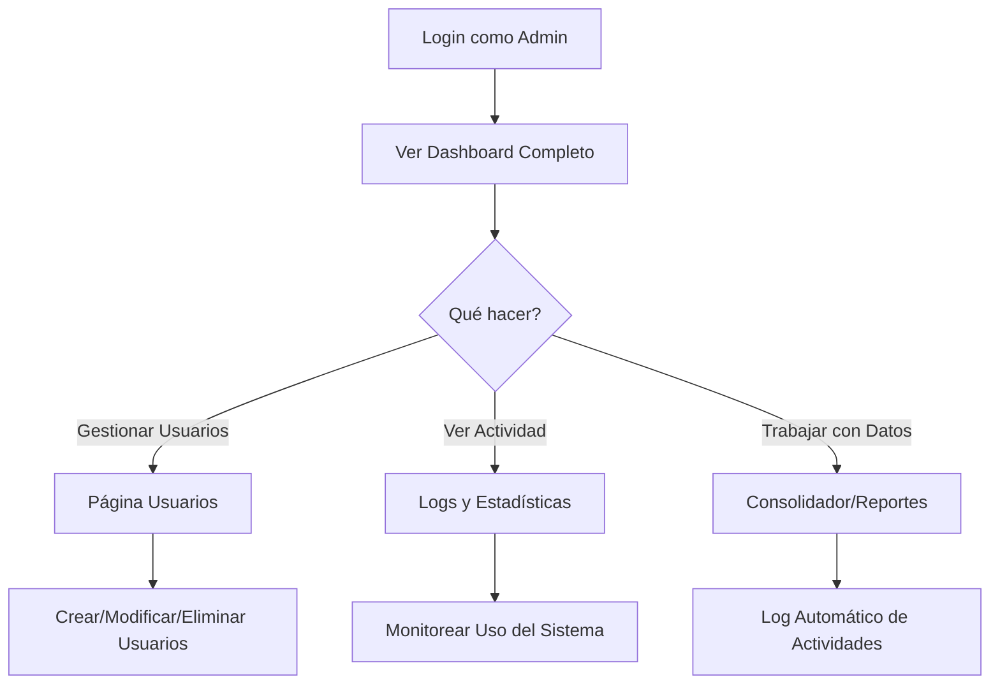
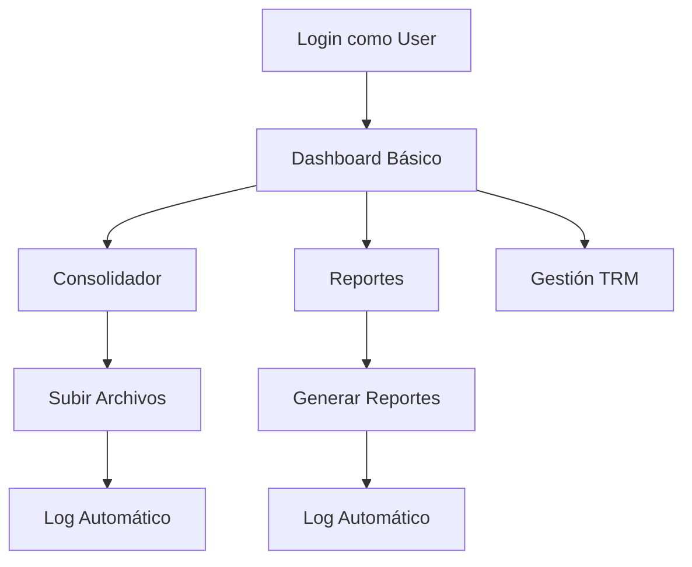

# 👥 Sistema de Usuarios - Guía Completa

## 🚀 Instalación y Configuración

### 1. Instalar Dependencias
```bash
pip install bcrypt>=4.0.0
```

### 2. Configurar Base de Datos en Supabase

#### Paso A: Ejecutar Script SQL
1. Ve a tu dashboard de Supabase
2. Abre el **SQL Editor**
3. Ejecuta el archivo `setup_users_database.sql`

#### Paso B: Configurar Variables de Entorno
Asegúrate de que tu archivo `.env` tenga:
```env
SUPABASE_URL=tu_url_aqui
SUPABASE_KEY=tu_key_aqui
```

## 👤 Usuarios Iniciales

### Usuario Administrador por Defecto
- **Usuario:** `admin`
- **Contraseña:** `admin123`
- **Email:** `admin@empresa.com`
- **Rol:** `admin`

⚠️ **IMPORTANTE:** Cambia esta contraseña después del primer login

## 🔐 Roles y Permisos

### 📋 Tipos de Roles

| Rol | Permisos |
|-----|----------|
| **admin** | ✅ Acceso completo<br>✅ Gestión de usuarios<br>✅ Ver todos los logs<br>✅ Todas las funciones |
| **user** | ✅ Usar Consolidador<br>✅ Ver reportes<br>✅ Gestión TRM<br>❌ No gestión usuarios |
| **viewer** | ✅ Solo lectura<br>✅ Ver reportes<br>❌ No modificar datos<br>❌ No gestión usuarios |

### 🛡️ Páginas Protegidas
- **👥 Usuarios**: Solo admins
- **🔧 Debug/Correcciones**: Solo admins
- **📦 Consolidador**: Users y admins
- **📊 Reportes**: Todos los roles

## 📊 Funcionalidades

### 🏠 Dashboard Principal
- **Login automático**: Se solicita al inicio
- **Info de usuario**: Aparece en sidebar
- **Menú dinámico**: Se adapta según el rol

### 👥 Gestión de Usuarios (Solo Admins)

#### ➕ Crear Usuario
1. Ir a página "👥 Usuarios"
2. Tab "➕ Nuevo Usuario"
3. Llenar formulario
4. Asignar rol apropiado

#### 🔧 Gestionar Usuarios
- **Activar/Desactivar**: Cambiar estado del usuario
- **Cambiar Rol**: Modificar permisos
- **Eliminar**: Remover usuario (no se puede auto-eliminar)

### 📈 Logs de Actividad

#### 🔍 Qué se Registra
- **Subida de archivos**: Drapify, Logistics, Aditionals, CXP
- **Procesamiento**: Consolidaciones exitosas
- **Gestión usuarios**: Crear, modificar, eliminar
- **Login/Logout**: Accesos al sistema

#### 📊 Información Guardada
```json
{
  "usuario": "nombre_usuario",
  "acción": "upload_file",
  "descripción": "Archivo Drapify procesado",
  "tipo_archivo": "drapify",
  "nombre_archivo": "datos.xlsx",
  "cantidad_registros": 150,
  "estado": "success",
  "fecha": "2025-01-13 10:30:00"
}
```

## 🔄 Flujo de Trabajo

### Para Administradores


### Para Usuarios Normales


## 🛠️ Configuración Avanzada

### 🔒 Seguridad
- **Contraseñas**: Hasheadas con bcrypt
- **Sesiones**: Tokens únicos con expiración
- **RLS**: Row Level Security en Supabase (opcional)

### ⏱️ Sesiones
- **Duración**: 24 horas por defecto
- **Auto-logout**: Al expirar la sesión
- **Token único**: Por cada login

### 📝 Personalización

#### Cambiar Duración de Sesión
En `modulos/auth.py`, línea ~65:
```python
expires_at = datetime.now() + timedelta(hours=24)  # Cambiar aquí
```

#### Agregar Más Roles
1. Modificar enum en SQL:
```sql
ALTER TYPE user_role ADD VALUE 'manager';
```

2. Actualizar validaciones en código

## 🐛 Solución de Problemas

### ❌ Error: "Module 'bcrypt' not found"
```bash
pip install bcrypt
```

### ❌ Error: "No connection to database"
- Verificar variables en `.env`
- Verificar que las tablas estén creadas
- Revisar permisos en Supabase

### ❌ Error: "User not found"
- Ejecutar el script SQL para crear usuario admin
- Verificar que la tabla `users` existe

### 🔄 Resetear Contraseña de Admin
```sql
UPDATE users 
SET password_hash = '$2b$12$LQv3c1yqBWVHxkd0LHAkCOYz6TtxMQJqhN8/LewLdoQQGgA8r8F/q'
WHERE username = 'admin';
-- Nueva contraseña: admin123
```

## 📈 Monitoreo y Estadísticas

### 📊 Métricas Disponibles
- Total de usuarios activos
- Logins por período
- Actividad por usuario
- Archivos procesados por día
- Errores y warnings

### 🔍 Consultas Útiles
```sql
-- Ver usuarios más activos
SELECT username, COUNT(*) as actividades
FROM activity_logs 
WHERE created_at > NOW() - INTERVAL '7 days'
GROUP BY username
ORDER BY actividades DESC;

-- Ver archivos procesados hoy
SELECT file_type, COUNT(*), SUM(records_count)
FROM activity_logs 
WHERE action = 'upload_file' 
AND DATE(created_at) = CURRENT_DATE
GROUP BY file_type;
```

## 🎯 Próximas Mejoras

### 🔄 En Desarrollo
- [ ] Recuperación de contraseña por email
- [ ] Autenticación de dos factores (2FA)
- [ ] Integración con Active Directory
- [ ] Notificaciones en tiempo real
- [ ] Dashboard de métricas avanzado

### 💡 Sugerencias
- [ ] Grupos de usuarios
- [ ] Permisos granulares por función
- [ ] Audit trail completo
- [ ] Backup automático de logs
- [ ] API para integración externa

---

## 🆘 Soporte

Si tienes problemas:
1. Revisa los logs en la página de Usuarios
2. Verifica la configuración de Supabase
3. Consulta este README
4. Contacta al administrador del sistema